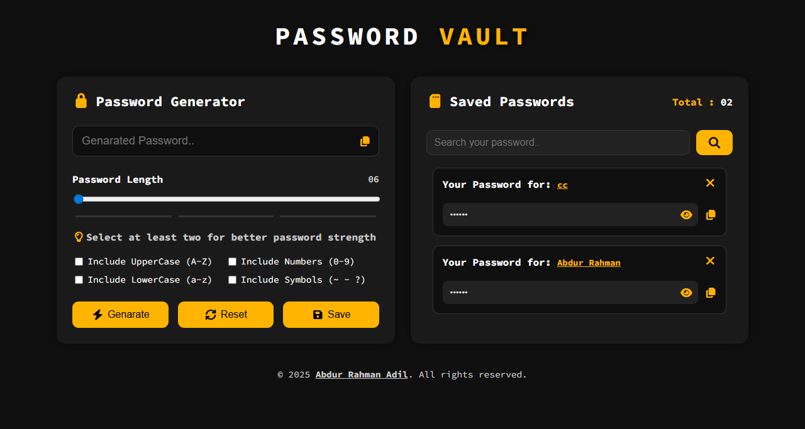
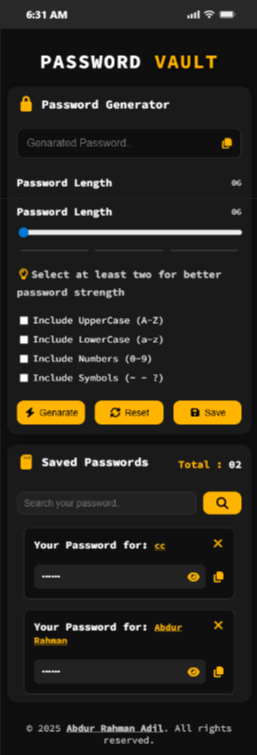

# Password Vault || Ultimate Password Generator & Manager

## Project Overview

**Password Vault** is a modern, user-friendly web application designed to help users **generate, manage, and securely store passwords**. It provides a simple interface with strong password generation capabilities, search functionality, and secure local storage for passwords. Ideal for personal use, it ensures you never forget your passwords while keeping them safe.

---

## Screen Shots

### Desktop View

### Android View

### iPhone View

## Features

* **Strong Password Generator:** Generate secure passwords with customizable options (uppercase, lowercase, numbers, symbols).
* **Password Strength Indicator:** Visual feedback for weak, medium, and strong passwords.
* **Save & Manage Passwords:** Store passwords along with the site name and optional URL in your local device storage.
* **Search Functionality:** Quickly search saved passwords.
* **Copy & View Passwords:** Easily copy or view saved passwords without exposing them permanently.
* **Delete Passwords:** Remove unnecessary or outdated passwords.
* **Responsive Design:** Fully responsive UI suitable for desktop, tablet, and mobile devices.
* **Modal Notifications:** Informative modals for saving, deleting, and error messages.

---

## Technologies Used

* **HTML5 & CSS3** – For structure and styling.
* **JavaScript** – For functionality including password generation, storage, and interactions.
* **Font Awesome** – For icons and visual enhancements.
* **Local Storage** – For storing passwords securely on the user’s device.
* **Google Fonts (Source Code Pro)** – For modern, readable typography.

---

## How to Use

1. Open the project in a web browser.
2. Select password length and options (uppercase, lowercase, numbers, symbols).
3. Click **Generate** to create a password.
4. Copy the generated password or save it by providing a site name and optional link.
5. Use the **search bar** to find saved passwords quickly.
6. Manage saved passwords by viewing, copying, or deleting them.

---

## Installation

1. Clone or download the repository.
2. Open the `index.html` file in your preferred browser.
3. Ensure `style.css` and `script.js` are linked correctly for proper functionality.

---

## Notes

* Passwords are stored locally on the user’s device; **there is no cloud storage**.
* For security, avoid sharing your device with others if sensitive passwords are stored.

---

## Author

**Abdur Rahman Adil**
Project: Password Vault || Ultimate Password Generator & Manager

---

## License

This project is for personal and educational use. All rights reserved to **Abdur Rahman Adil**.
